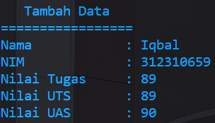

# Praktikum8
## $${\color{blue}OOP (Objek Oriented Programming)}$$

## Profil
| Variable | Isi |
| -------- | --- |
| *Nama* | Muhammad Iqbal Al Anshori  |
| *NIM* |  312310659 |
| *Kelas* | TI.23.A.6 |
| *Mata Kuliah* | Bahasa Pemrograman |

# $${\color{blue}PYTHON}$$

# Menambah Data

# Menampilkan Data

# Menghapus Data

# Mengubah Data

